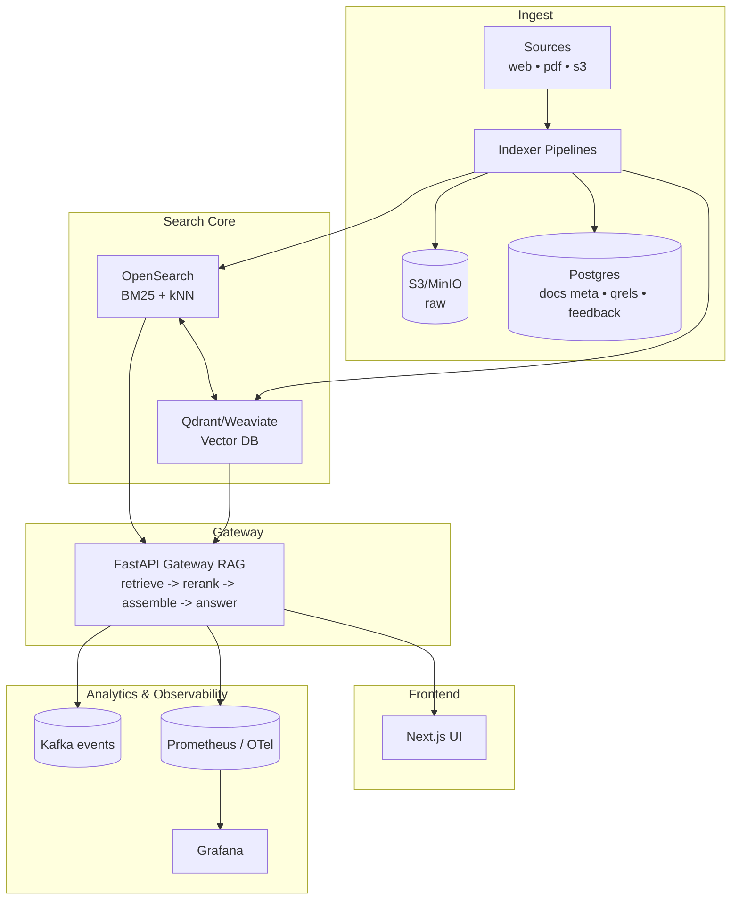
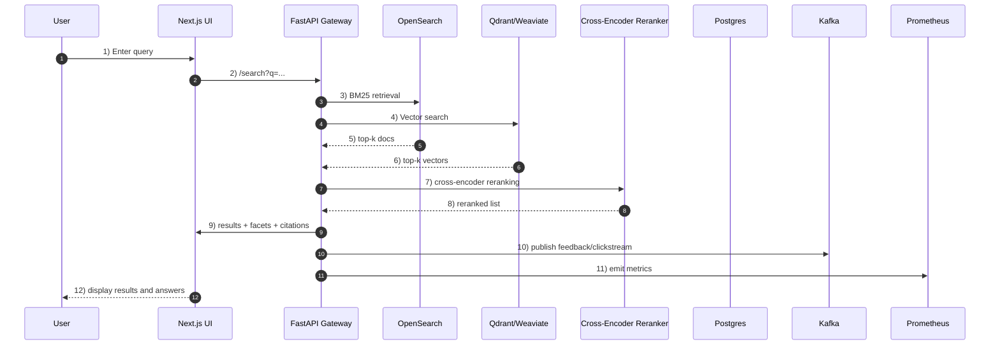

# SearchIt - Neural Search Engine with RAG

A hybrid semantic search and grounded QA system featuring OpenSearch BM25 + Vector DB, cross-encoder reranking, grounded generation with citation spans, feedback loops, and comprehensive evaluation harness.

> Try it now: [Live Demo](https://searchit-demo.vercel.app) | Documentation: [Full Guide](docs/) | Quick Start: 3 commands below

## Features

- **Hybrid Search**: BM25 + Dense vectors with RRF fusion for superior recall
- **Smart Reranking**: Cross-encoder reranking for improved precision
- **Grounded QA**: Citation-aware answer generation with abstention logic
- **Feedback Loops**: Click tracking and relevance feedback collection
- **Evaluation**: Automated metrics and regression testing framework
- **Observability**: Prometheus metrics, Grafana dashboards, OpenTelemetry tracing
- **Modern UI**: Next.js 14 with Tailwind CSS and dark mode
- **Production Ready**: Docker Compose with health checks and monitoring

## Quick Start (3 Commands)

```bash
make dev-up
make index-toy
make demo
```
- **Web UI**: http://localhost:3000
- **API Docs**: http://localhost:8000/docs
- **Metrics**: http://localhost:9090 (Prometheus)
- **Dashboards**: http://localhost:3001 (Grafana)

## Architecture



## End-to-End Search Flow



## Component Responsibilities (quick scan)

- **Indexer Pipelines:** Ingest documents from web, PDFs, S3; store raw in MinIO, metadata in Postgres.
- **Search Core (OpenSearch + Vector DB):** Hybrid retrieval with BM25 + dense vectors, fused results.
- **Gateway (FastAPI):** RAG pipeline (retrieve → rerank → assemble → generate), provides API endpoints.
- **Reranker (Cross-Encoder):** Improves precision by reranking candidate docs.
- **Frontend (Next.js):** Modern search UI with facets, citations, and feedback.
- **Storage:** Postgres for metadata/qrels/feedback; MinIO for raw docs.
- **Analytics & Observability:** Kafka for events, Prometheus for metrics, Grafana for dashboards.

## Tech Stack

| Component         | Technology            | Purpose                         |
| ----------------- | --------------------- | ------------------------------- |
| **Search Core**   | OpenSearch + Qdrant   | BM25 + Vector search            |
| **Gateway**       | FastAPI + Uvicorn     | RAG API with async support      |
| **Embeddings**    | SentenceTransformers  | e5-base model for dense vectors |
| **Reranker**      | Cross-Encoder         | ms-marco-MiniLM-L-6-v2          |
| **Frontend**      | Next.js 14 + Tailwind | Modern responsive UI            |
| **Storage**       | Postgres 15 + MinIO   | Metadata + object storage       |
| **Analytics**     | Kafka (Redpanda)      | Event streaming                 |
| **Observability** | Prometheus + Grafana  | Metrics & dashboards            |

## API Examples

### Search

```bash
curl "http://localhost:8000/search?q=how%20to%20index%20pdfs&top_k=10&filters=lang:en"
```

**Response:**

```json
{
  "query": "how to index pdfs",
  "results": [
    {
      "doc_id": "D1",
      "chunk_id": "C1",
      "score": 14.2,
      "title": "Ingesting PDFs",
      "url": "/docs/pdfs",
      "highlights": ["... extract text with OCR ..."],
      "section": "ingest",
      "lang": "en",
      "tags": ["pdf", "ingest"]
    }
  ],
  "facets": { "lang": { "en": 120 }, "tags": { "pdf": 80 } }
}
```

### Ask

```bash
curl -X POST http://localhost:8000/ask \
  -H "Content-Type: application/json" \
  -d '{"question": "How do I chunk PDFs for RAG?", "top_k": 8}'
```

**Response:**

```json
{
  "answer": "Split by headings, 250–500 tokens with overlap...",
  "citations": [{ "chunk_id": "C1", "span": { "start": 120, "end": 220 } }],
  "evidence_coverage": 0.82,
  "abstained": false
}
```

### Feedback

```bash
curl -X POST http://localhost:8000/feedback \
  -H "Content-Type: application/json" \
  -d '{"query": "chunk pdf", "doc_id": "D1", "chunk_id": "C1", "label": "thumbs_up"}'
```

## Development

```bash
# Setup development environment
make setup          # Install all dependencies
make dev-up         # Start all services with Docker Compose
make index-toy      # Index sample corpus for testing
make test           # Run all tests (pytest + jest)
make demo           # Run interactive demo script

# Development workflow
make fmt            # Format code (black + prettier)
make lint           # Lint code (ruff + eslint)
make smoke          # Run smoke tests
make clean          # Clean temporary files
```

## Evaluation & Metrics

### Automated Evaluation

```bash
make eval           # Run evaluation harness
make eval-report    # Generate reports with visualizations
make build-qrels    # Build relevance judgments
```

**Metrics Tracked:**

- **Retrieval**: Recall@K, MRR, NDCG@10
- **Generation**: Abstain rate, coverage, response time
- **System**: Latency, throughput, error rates

### Observability

- **Prometheus**: http://localhost:9090 - Metrics collection
- **Grafana**: http://localhost:3001 - Dashboards & alerting
- **Health**: http://localhost:8000/health - Service health

## Documentation

| Guide                                  | Description                        |
| -------------------------------------- | ---------------------------------- |
| [Architecture](docs/architecture.md)   | System design and components       |
| [API Reference](docs/api.md)           | Complete API documentation         |
| [Evaluation](docs/eval.md)             | Evaluation methodology and metrics |
| [Observability](docs/observability.md) | Monitoring and troubleshooting     |
| [Deployment](docs/deployment.md)       | Production deployment guide        |

## Use Cases

- **Enterprise Search**: Internal document search with RAG
- **Customer Support**: Knowledge base with grounded answers
- **Research**: Academic paper search with citations
- **E-commerce**: Product search with recommendations
- **Legal**: Case law search with evidence extraction

## Configuration

Key environment variables in `.env`:

```bash
# Search backends
OPENSEARCH_URL=http://opensearch:9200
QDRANT_URL=http://qdrant:6333

# Models
EMBED_MODEL=intfloat/e5-base
RERANKER_MODEL=cross-encoder/ms-marco-MiniLM-L-6-v2

# Storage
POSTGRES_HOST=postgres
MINIO_ENDPOINT=http://minio:9000
```

## Contributing

## Performance

**Benchmarks**:

- **Search Latency**: P95 < 100ms
- **Ask Latency**: P95 < 2s
- **Throughput**: 100+ queries/second
- **Recall@10**: > 75%
- **MRR**: > 60%

## Security

- Input validation and sanitization
- Rate limiting and DDoS protection
- Secure API key management
- No PII logging or storage
- Container security best practices

## License

This project is licensed under the MIT License - see the [LICENSE](LICENSE) file for details.
